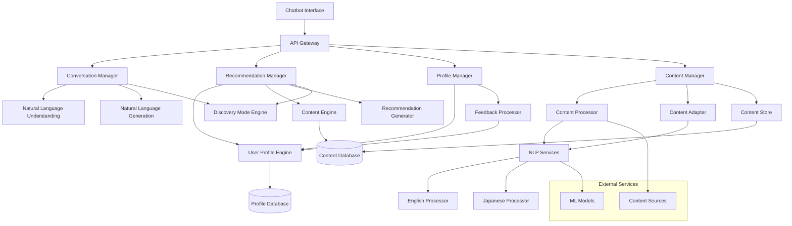

# Design Document: Noah Reading Agent

## Overview

Noah is an intelligent reading agent presented as a conversational chatbot that learns from user behavior to provide personalized content recommendations, reading level assessments, and content adaptations. The system operates across English and Japanese languages, maintaining separate proficiency models while providing a unified conversational user experience.

Noah engages users through natural conversation, understanding requests for book recommendations and offering a "discovery mode" that suggests content outside users' typical reading habits. The architecture follows a modular design with clear separation between conversational interface, content processing, user modeling, recommendation generation, and multilingual support.

## Architecture



The system is built around five core managers:

1. **Conversation Manager**: Handles natural language understanding, response generation, and conversation flow
2. **Recommendation Manager**: Orchestrates the recommendation process by combining user profiles with content analysis
3. **Profile Manager**: Handles user preference learning, feedback processing, and profile transparency
4. **Content Manager**: Processes, adapts, and stores content across multiple languages
5. **API Gateway**: Provides a unified interface for all client interactions

6. **Recommendation Manager**: Orchestrates the recommendation process by combining user profiles with content analysis
7. **Profile Manager**: Handles user preference learning, feedback processing, and profile transparency
8. **Content Manager**: Processes, adapts, and stores content across multiple languages
9. **API Gateway**: Provides a unified interface for all client interactions

## Components and Interfaces

### Conversation Manager

The Conversation Manager handles all natural language interactions with users, providing a chatbot interface that understands context and maintains conversational flow.

**Core Responsibilities:**

- Process natural language input and understand user intent
- Generate conversational responses that feel natural and engaging
- Maintain conversation context and session state
- Coordinate with other managers to fulfill user requests

**Key Features:**

- Natural language understanding for book recommendations, questions, and casual conversation
- Context-aware response generation that remembers previous interactions
- Integration with recommendation and content systems for seamless user experience

### User Profile Engine

The User Profile Engine maintains comprehensive models of user preferences, reading levels, and behavioral patterns.

**Core Responsibilities:**

- Track reading behavior patterns (speed, completion rates, re-reading frequency)
- Maintain separate reading level assessments for English and Japanese
- Model preference evolution over time
- Process implicit and explicit feedback signals

**Key Data Models:**

```python
from sqlalchemy import Column, String, DateTime, Integer, Float, JSON, ForeignKey
from sqlalchemy.ext.declarative import declarative_base
from sqlalchemy.orm import relationship
from datetime import datetime
from typing import List, Dict, Optional
from pydantic import BaseModel

Base = declarative_base()

class UserProfile(Base):
    __tablename__ = "user_profiles"

    user_id = Column(String, primary_key=True)
    preferences = Column(JSON)  # PreferenceModel as JSON
    reading_levels = Column(JSON)  # LanguageReadingLevels as JSON
    last_updated = Column(DateTime, default=datetime.utcnow)

    behavior_history = relationship("ReadingBehavior", back_populates="user_profile")

class PreferenceModel(BaseModel):
    topics: List[Dict]
    content_types: List[Dict]
    contextual_preferences: List[Dict]
    evolution_history: List[Dict]

class LanguageReadingLevels(BaseModel):
    english: Dict
    japanese: Dict
```

### Content Processor

Handles multilingual content analysis, complexity assessment, and metadata extraction.

**Core Responsibilities:**

- Analyze content for topic, complexity, and reading level
- Extract key themes and concepts
- Generate content embeddings for similarity matching
- Assess language-specific readability metrics

**Language-Specific Processing:**

- **English**: Uses Flesch-Kincaid, SMOG, and Coleman-Liau readability formulas
- **Japanese**: Analyzes kanji density, sentence complexity, and vocabulary difficulty levels

### Content Adapter

Transforms content to match user reading levels while preserving meaning and cultural context.

**Adaptation Strategies:**

- **Vocabulary Simplification**: Replace complex terms with simpler alternatives
- **Sentence Structure**: Break down complex sentences while maintaining flow
- **Cultural Context**: Preserve language-specific nuances and cultural references
- **Meaning Preservation**: Ensure core information and author intent remain intact

### Recommendation Generator

Combines user profiles with content analysis to generate contextually appropriate recommendations.

**Recommendation Factors:**

- Interest score based on topic preferences
- Reading level appropriateness
- Contextual factors (time available, mood, device)
- Content diversity to prevent filter bubbles
- Temporal patterns and user habits

### Discovery Mode Engine

Provides "I'm feeling lucky" functionality by deliberately suggesting content outside users' established preferences.

**Core Responsibilities:**

- Identify genres and topics the user hasn't explored
- Select discovery content that diverges from established patterns while remaining accessible
- Balance novelty with user compatibility to avoid completely incompatible suggestions
- Track user responses to discovery recommendations for improvement

**Discovery Strategies:**

- Genre expansion: Suggest books in unexplored genres
- Author diversity: Recommend authors from different backgrounds or writing styles
- Topic bridging: Find content that connects user interests to new areas
- Serendipitous matching: Use collaborative filtering to find unexpected connections

### Feedback Processor

Processes both explicit and implicit feedback to continuously improve user models.

**Feedback Types:**

- **Explicit**: Ratings, likes/dislikes, contextual comments
- **Implicit**: Reading time, completion rates, scrolling patterns, return visits
- **Behavioral**: Sharing, saving, highlighting, note-taking

## Data Models

### Content Model

```python
from sqlalchemy import Column, String, DateTime, Integer, Float, JSON, Text
from sqlalchemy.ext.declarative import declarative_base
from pydantic import BaseModel
from datetime import datetime
from typing import List, Dict, Optional

class ContentItem(Base):
    __tablename__ = "content_items"

    id = Column(String, primary_key=True)
    title = Column(String, nullable=False)
    content = Column(Text, nullable=False)
    language = Column(String, nullable=False)  # "english" or "japanese"
    metadata = Column(JSON)  # ContentMetadata as JSON
    analysis = Column(JSON)  # ContentAnalysis as JSON
    adaptations = Column(JSON)  # List of ContentAdaptation as JSON
    created_at = Column(DateTime, default=datetime.utcnow)

class ContentMetadata(BaseModel):
    author: str
    source: str
    publish_date: datetime
    content_type: str
    estimated_reading_time: int
    tags: List[str]

class ContentAnalysis(BaseModel):
    topics: List[Dict]
    reading_level: Dict
    complexity: Dict
    embedding: List[float]
    key_phrases: List[str]
```

### Reading Behavior Model

```python
class ReadingBehavior(Base):
    __tablename__ = "reading_behaviors"

    id = Column(Integer, primary_key=True, autoincrement=True)
    content_id = Column(String, ForeignKey("content_items.id"))
    user_id = Column(String, ForeignKey("user_profiles.user_id"))
    session_id = Column(String, nullable=False)
    start_time = Column(DateTime, nullable=False)
    end_time = Column(DateTime)
    completion_rate = Column(Float)
    reading_speed = Column(Float)
    pause_patterns = Column(JSON)  # List of pause events
    interactions = Column(JSON)  # List of interaction events
    context = Column(JSON)  # ReadingContext as JSON

    user_profile = relationship("UserProfile", back_populates="behavior_history")
    content_item = relationship("ContentItem")

class ReadingContext(BaseModel):
    time_of_day: str
    device_type: str
    location: Optional[str] = None
    available_time: Optional[int] = None
    user_mood: Optional[str] = None
```

### Preference Evolution Model

```python
class PreferenceSnapshot(Base):
    __tablename__ = "preference_snapshots"

    id = Column(Integer, primary_key=True, autoincrement=True)
    user_id = Column(String, ForeignKey("user_profiles.user_id"))
    timestamp = Column(DateTime, default=datetime.utcnow)
    topic_weights = Column(JSON)  # Dict mapping topics to weights
    reading_level_preference = Column(Float)
    contextual_factors = Column(JSON)  # Dict of contextual factors
    confidence_score = Column(Float)

class TopicPreference(BaseModel):
    topic: str
    weight: float
    confidence: float
    last_updated: datetime
    evolution_trend: str  # "increasing", "decreasing", or "stable"
```

### Conversation Model

```python
class ConversationSession(Base):
    __tablename__ = "conversation_sessions"

    session_id = Column(String, primary_key=True)
    user_id = Column(String, ForeignKey("user_profiles.user_id"))
    context = Column(JSON)  # ConversationContext as JSON
    start_time = Column(DateTime, default=datetime.utcnow)
    last_activity = Column(DateTime, default=datetime.utcnow)
    is_persistent = Column(Boolean, default=True)

    messages = relationship("ConversationMessage", back_populates="session")

class ConversationMessage(Base):
    __tablename__ = "conversation_messages"

    message_id = Column(String, primary_key=True)
    session_id = Column(String, ForeignKey("conversation_sessions.session_id"))
    sender = Column(String, nullable=False)  # "user" or "noah"
    content = Column(Text, nullable=False)
    timestamp = Column(DateTime, default=datetime.utcnow)
    intent = Column(JSON)  # UserIntent as JSON
    recommendations = Column(JSON)  # List of ContentRecommendation

    session = relationship("ConversationSession", back_populates="messages")

class ConversationHistory(Base):
    __tablename__ = "conversation_histories"

    user_id = Column(String, primary_key=True)
    total_messages = Column(Integer, default=0)
    first_interaction = Column(DateTime)
    last_interaction = Column(DateTime)
    conversation_summaries = Column(JSON)  # List of ConversationSummary

class ConversationContext(BaseModel):
    current_topic: Optional[str] = None
    recent_recommendations: List[str] = []
    user_mood: Optional[str] = None
    discovery_mode_active: bool = False
    preferred_language: str = "english"  # "english" or "japanese"
```

### Discovery Recommendation Model

```python
class DiscoveryRecommendation(Base):
    __tablename__ = "discovery_recommendations"

    id = Column(Integer, primary_key=True, autoincrement=True)
    content_id = Column(String, ForeignKey("content_items.id"))
    user_id = Column(String, ForeignKey("user_profiles.user_id"))
    divergence_score = Column(Float, nullable=False)
    bridging_topics = Column(JSON)  # List of topics
    discovery_reason = Column(String, nullable=False)
    user_response = Column(String)  # "interested", "not_interested", "saved"
    response_timestamp = Column(DateTime)
    created_at = Column(DateTime, default=datetime.utcnow)

    content_item = relationship("ContentItem")
    user_profile = relationship("UserProfile")
```

## Correctness Properties

_A property is a characteristic or behavior that should hold true across all valid executions of a system—essentially, a formal statement about what the system should do. Properties serve as the bridge between human-readable specifications and machine-verifiable correctness guarantees._

### Property 1: Comprehensive Reading Behavior Tracking

_For any_ reading session, Noah should track all specified behavioral metrics including time spent, completion rates, reading speed, and interaction patterns, ensuring complete behavioral data collection.
**Validates: Requirements 1.1, 5.1**

### Property 2: Feedback Integration Consistency

_For any_ user feedback (explicit ratings, implicit signals, or contextual comments), Noah should consistently incorporate this feedback into preference models and immediately reflect changes in future recommendations.
**Validates: Requirements 1.2, 7.1, 7.2, 7.5**

### Property 3: Preference Evolution Detection

_For any_ sequence of user interactions over time, if reading patterns indicate changing preferences, Noah should detect these shifts and adapt the user profile accordingly.
**Validates: Requirements 1.3, 7.4**

### Property 4: Comprehensive Content Analysis

_For any_ content item in English or Japanese, Noah should analyze it for topics, complexity, reading level using appropriate language-specific metrics, and generate consistent interest scores based on user profiles.
**Validates: Requirements 2.1, 2.2, 2.3, 9.2, 9.3**

### Property 5: Contextual Recommendation Generation

_For any_ recommendation request with specified context (time available, mood, device, location), Noah should generate recommendations that appropriately consider all contextual factors and match content to constraints.
**Validates: Requirements 3.1, 3.2, 3.3**

### Property 6: Autonomous Content Selection

_For any_ user profile with sufficient learning history, Noah should be able to autonomously select appropriate content that aligns with learned preferences without explicit user input.
**Validates: Requirements 3.5**

### Property 7: Adaptive Content Processing

_For any_ content and user reading level, Noah should adapt content appropriately—simplifying when above user level, preserving when at or below level—while maintaining meaning and factual accuracy.
**Validates: Requirements 4.1, 4.2, 4.3, 4.4**

### Property 8: Progressive Difficulty Management

_For any_ user showing improved reading skills in specific topics, Noah should gradually suggest more challenging content in familiar areas before introducing complexity in unfamiliar topics.
**Validates: Requirements 5.2, 5.3, 5.4**

### Property 9: Multi-dimensional Reading Level Tracking

_For any_ user profile, Noah should maintain separate reading level assessments for different languages, subject areas, and content types, ensuring granular skill tracking.
**Validates: Requirements 5.5, 9.4**

### Property 10: Content Storage and Retrieval Consistency

_For any_ saved content, Noah should store complete metadata and provide relevant search results based on both content similarity and metadata matching.
**Validates: Requirements 6.1, 6.2, 6.4**

### Property 11: Profile Learning from History

_For any_ user interaction history (saved content, reading patterns, feedback), Noah should use this data to continuously refine user profile accuracy and improve future recommendations.
**Validates: Requirements 6.3, 7.3**

### Property 12: Preference Transparency and Control

_For any_ user profile, Noah should provide clear, explainable summaries of learned preferences with derivation explanations, allow manual adjustments, and immediately reflect changes in recommendations.
**Validates: Requirements 8.1, 8.2, 8.3, 8.4, 8.5**

### Property 13: Multilingual Processing Consistency

_For any_ content in English or Japanese, Noah should process it using appropriate language-specific methods while maintaining separate proficiency assessments and preserving cultural context during adaptations.
**Validates: Requirements 9.1, 9.5**

### Property 14: Language Preference Respect

_For any_ user-specified language preferences, Noah should respect these settings in recommendations and content adaptations, ensuring language-appropriate suggestions.
**Validates: Requirements 9.6**

### Property 15: Content Difficulty Flagging

_For any_ content that exceeds a user's reading level, Noah should correctly flag it for potential adaptation and suggest appropriate alternatives.
**Validates: Requirements 2.4**

### Property 16: Context Inference from Patterns

_For any_ user with sufficient historical data, when no explicit context is provided, Noah should infer likely context from established behavioral patterns.
**Validates: Requirements 3.4**

### Property 17: Conversational Interface Consistency

_For any_ user message in a conversational session, Noah should respond appropriately while maintaining conversation context and understanding user intent across different types of requests.
**Validates: Requirements 10.1, 10.2, 10.3, 10.4, 10.5, 10.6**

### Property 18: Discovery Mode Divergence

_For any_ user profile with established preferences, discovery mode should recommend content that deliberately diverges from typical preferences while remaining accessible at the user's reading level.
**Validates: Requirements 12.1, 12.2, 12.3, 12.4, 12.5, 12.6**

### Property 19: Persistent Memory and User Isolation

_For any_ user interaction, Noah should maintain persistent conversation history across sessions while ensuring complete data isolation between users with no information leakage.
**Validates: Requirements 10.6, 13.1, 13.2, 13.3, 13.4, 13.5, 13.6**

## Error Handling

The system implements comprehensive error handling across all components:

### Content Processing Errors

- **Invalid Content Format**: Gracefully handle malformed or corrupted content by logging errors and skipping processing
- **Language Detection Failures**: Default to English processing when language cannot be determined, with user notification
- **Analysis Timeouts**: Implement timeouts for content analysis operations with fallback to basic metadata extraction

### User Profile Errors

- **Insufficient Data**: Handle new users or sparse data scenarios by using default preferences and conservative recommendations
- **Corrupted Profile Data**: Implement profile validation and recovery mechanisms with backup preference models
- **Preference Conflicts**: Resolve conflicting preference signals using weighted confidence scores and temporal recency

### Recommendation Errors

- **No Suitable Content**: When no content matches user criteria, provide explanation and suggest broadening preferences
- **Context Inference Failures**: Fall back to general recommendations when context cannot be inferred from patterns
- **Performance Degradation**: Implement caching and optimization strategies for recommendation generation under load

### Multilingual Processing Errors

- **Translation Failures**: Maintain original content when adaptation fails, with clear user notification
- **Cultural Context Loss**: Preserve original alongside adapted content when cultural nuances cannot be maintained
- **Encoding Issues**: Handle character encoding problems gracefully with appropriate fallback mechanisms

## Testing Strategy

The testing approach combines unit tests for specific functionality with property-based tests for universal correctness guarantees.

### Property-Based Testing

Property-based tests will validate the universal properties defined above using a minimum of 100 iterations per test. Each test will be implemented using the Hypothesis library for Python, with tests tagged according to the format: **Feature: reading-agent, Property {number}: {property_text}**.

Key property test categories:

- **Behavioral Consistency**: Verify that user behavior tracking and preference learning work consistently across all input variations
- **Content Processing**: Ensure content analysis and adaptation maintain quality across diverse content types and languages
- **Recommendation Quality**: Validate that recommendations appropriately consider all specified factors and constraints
- **Multilingual Support**: Verify correct processing and cultural preservation across English and Japanese content

### Unit Testing

Unit tests will focus on specific examples, edge cases, and integration points using pytest:

- **Content Analysis Edge Cases**: Empty content, extremely short/long content, mixed-language content
- **User Profile Boundaries**: New users, users with conflicting preferences, users with sparse data
- **Recommendation Scenarios**: No available content, all content too difficult/easy, context conflicts
- **Error Conditions**: Network failures, corrupted data, invalid input formats

### Integration Testing

- **End-to-End Workflows**: Complete user journeys from content ingestion to recommendation delivery
- **Cross-Component Communication**: Verify proper data flow between profile engine, content processor, and recommendation generator
- **Performance Testing**: Ensure system maintains responsiveness under realistic load conditions using pytest-benchmark
- **Multilingual Integration**: Verify seamless operation across language boundaries and cultural contexts

The testing strategy ensures both correctness (through property-based testing) and reliability (through comprehensive unit and integration testing), providing confidence in Noah's ability to deliver personalized, culturally-aware reading experiences across multiple languages.
